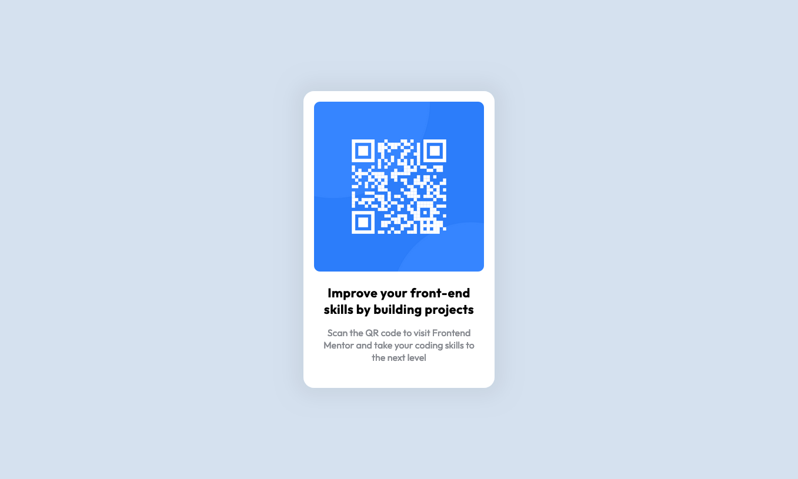

# QR Code Component Solution (Frontend Mentor)

This is my solution to the [QR Code Component Challenge on Frontend Mentor](https://www.frontendmentor.io/challenges/qr-code-component-iux_sIO_H). Frontend Mentor helps improve frontend coding skills by challenging developers to build realistic projects.

## Table of contents

- [Overview](#overview)
  - [Screenshot](#screenshot)
  - [Links](#links)
- [Built With](#built-with)
- [Author](#author)

## Overview

### Screenshot

### Links

- Solution URL: [QR Code Component Solution](./index.html)
- Live Site URL: [QR Code Component Live](https://fastidious-dragon-112045.netlify.app)

## Built With

- Semantic HTML5
- CSS Classes
- Flexbox

## Author

- Website - [Tye Porter](https://www.github.com/4orter)
- Frontend Mentor - [@4orter](https://www.frontendmentor.io/profile/4orter)
- Twitter - [@4orter](https://www.twitter.com/4orter)

