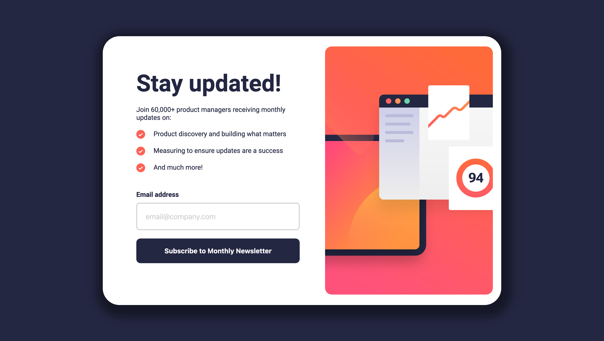

# Newsletter Sign Up Solution (Frontend Mentor)

This is my solution to the [Newsletter Sign Up Challenge on Frontend Mentor](https://www.frontendmentor.io/challenges/newsletter-signup-form-with-success-message-3FC1AZbNrv), built with Astro SSR (for backend validation) and Svelte. Frontend Mentor helps improve frontend coding skills by challenging developers to build realistic projects.

## Table of contents

- [Overview](#overview)
  - [Screenshot](#screenshot)
  - [Links](#links)
- [Built With](#built-with)
- [Author](#author)

## Overview

### Screenshot

### Links

- Solution URL: [Newsletter Sign Up Solution](./README.md)
- Live Site URL: [Newsletter Sign Up Live](https://magnificent-tanuki-17c4c2.netlify.app/)

## Built With

- Astro
- Svelte
- Netlify Functions
- Semantic HTML5
- CSS Classes
- Flexbox

## Author

- Website - [Tye Porter](https://www.github.com/4orter)
- Frontend Mentor - [@4orter](https://www.frontendmentor.io/profile/4orter)
- Twitter - [@4orter](https://www.twitter.com/4orter)
